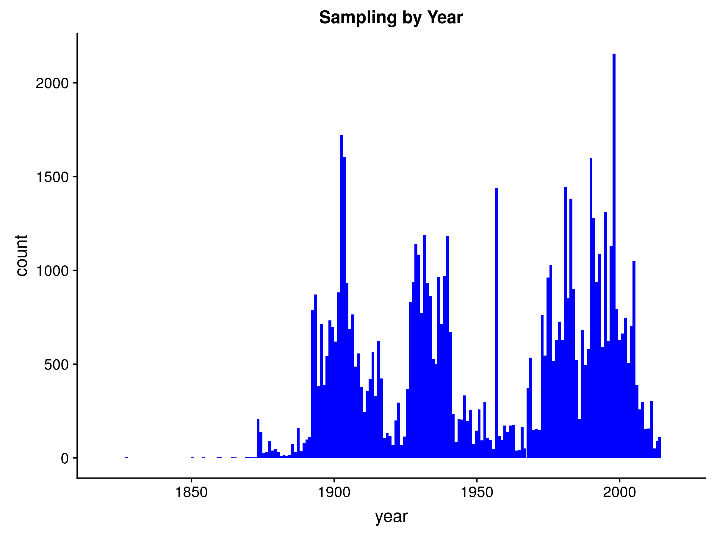
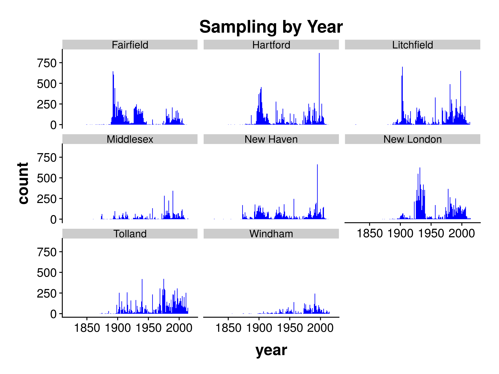
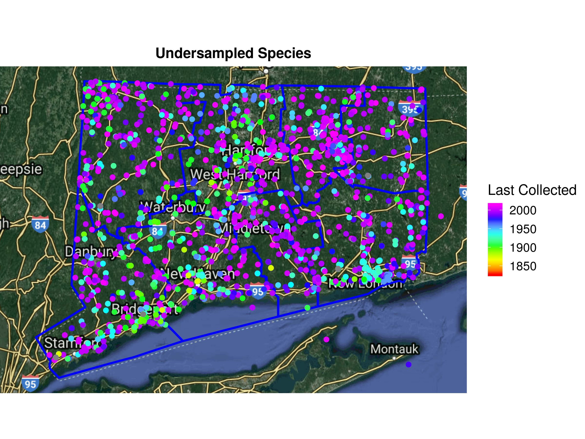
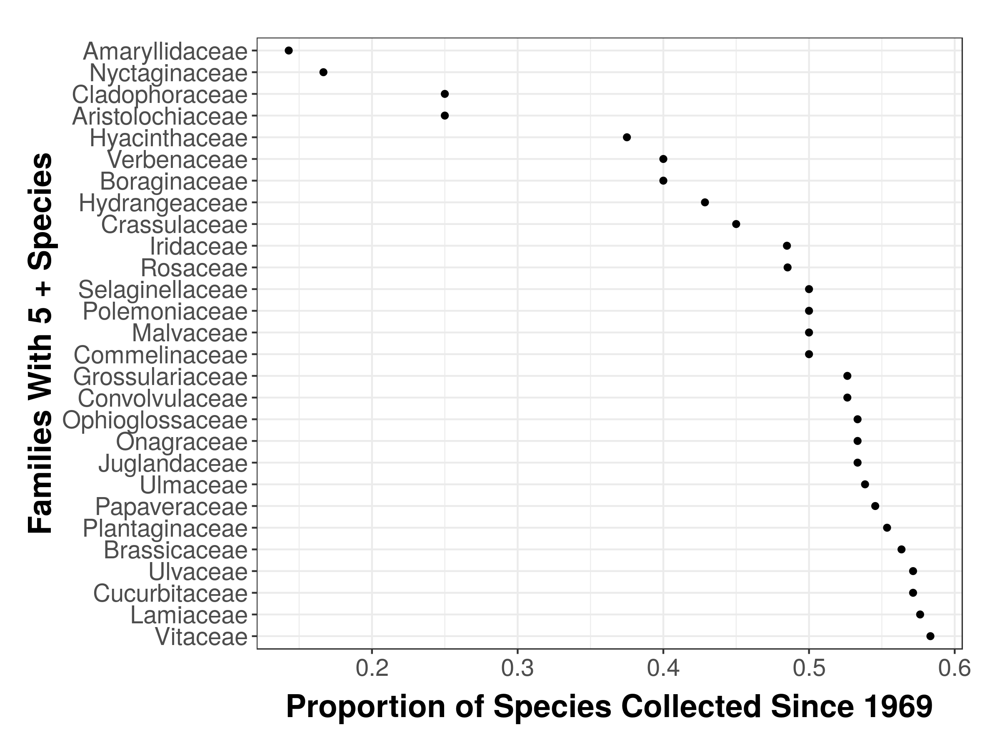

Analysis of CONN Collection
================
James Mickley
January 07, 2019

-   [Overview](#overview)
    -   [Summary of Results](#summary-of-results)
-   [Sampling](#sampling)
    -   [Statewide](#statewide)
    -   [By County](#by-county)
    -   [By Taxonomic Order](#by-taxonomic-order)
-   [Undersampled Species](#undersampled-species)
-   [Number of Species Not Collected in 50 Years](#number-of-species-not-collected-in-50-years)
    -   [For The State](#for-the-state)
-   [Session Information](#session-information)

Overview
--------

A quick analysis of the CONN collection, based on data from the [NEHerbaria Portal](http://neherbaria.org/). I pulled all of the records from CT (205,000), of which 70,000 were from CONN.

For now, restricting the data to CONN, though this could be run on the full dataset as well.

**Note:** The locality-based portion of this analysis does not include location-restricted records, so rare species are likely underrepresented. I don't have this data.

### Summary of Results

-   

Sampling
--------

### Statewide

|  families|  species|  specimens|
|---------:|--------:|----------:|
|       314|     4612|      70337|

A statewide species list, with \# of specimens per species and last collected year is available at [ct-specieslist.csv](data/species-lists/ct-specieslist.csv).

The northeast corner of the state (Windham County), nothern New London County, and the southern half of Litchfield County look more sparsely sampled.

### By County

Windham and Middlesex counties stand out as having less sampling, both across time and overall. They were largely ignored prior to 1970. Litchfield, New London and Fairfield, and Tolland have been comparatively well sampled recently, slightly less so for New Haven.

County level species lists, with \# of specimens and last collected year for that county are available in [species-lists](data/species-lists/).

| county     |  families|  species|  specimens|
|:-----------|---------:|--------:|----------:|
| Fairfield  |       211|     2545|      10834|
| Hartford   |       171|     2143|      10359|
| Litchfield |       189|     2171|      11750|
| Middlesex  |       156|     1423|       4151|
| New Haven  |       199|     2129|       7792|
| New London |       205|     2348|      11025|
| Tolland    |       241|     2247|      10941|
| Windham    |       144|     1126|       3329|

### By Taxonomic Order

Less useful than I thought, leaving it up just in case. The undersampled species are widely distributed taxonomically I guess.

Undersampled Species
--------------------

One way to get at data-deficient species, is to look at the number of species with very few records.

Of the 4600 species recorded, more than half have less than 10 specimens statewide, and over 1000 species are only represented by one observation. These would be a good target, though it's possible some are outdated names or something of that sort.

Notably though, most of the undersampled species were collected recently. There are pockets of undersampled species that haven't been collected recently in the CT River Valley, New London, and the NW corner that might be worth looking into.

|  species|  num.specimens|
|--------:|--------------:|
|     1066|              1|
|      497|              2|
|      363|              3|
|      238|              4|
|      164|              5|
|      141|              6|
|      129|              7|
|      108|              8|
|       94|              9|
|       89|             10|

Number of Species Not Collected in 50 Years
-------------------------------------------

A second way of looking for data-deficient species is finding species that haven't been collected in a while. These species could be extinct in CT (especially for prairie species), but they could also be difficult to identify (Poales), rare, or infrequently collected.

I set the threshold at 50 years or 1969.

### For The State

For all of CT, the families with the most of these sorts of species are plotted below. Poaceae and Cyperaceae are well-represented, but there is also a lot of missing diversity in common families: Asteraceae, Rosaceae, Brassicaceae, Lamiaceae, Fabaceae, etc.

Another way to look at this is by looking at the proportion of species in the family that haven't been collected recently. This gives a different set of families. Both would make good collecting targets.

A static map of where these species are is below. Many were collected in New London, Storrs, and the CT River Valley.

Or there's an [interactive map](http://mickley.github.io/CT-Herbarium-Specimens/analyses/CT-Old-Map.html) that lets you zoom in to particular areas and see which species were collected there.

Session Information
-------------------

    R version 3.5.1 (2018-07-02)
    Platform: x86_64-pc-linux-gnu (64-bit)
    Running under: Ubuntu 18.04.1 LTS

    Matrix products: default
    BLAS: /usr/lib/x86_64-linux-gnu/blas/libblas.so.3.7.1
    LAPACK: /usr/lib/x86_64-linux-gnu/lapack/liblapack.so.3.7.1

    locale:
     [1] LC_CTYPE=en_US.UTF-8       LC_NUMERIC=C              
     [3] LC_TIME=en_US.UTF-8        LC_COLLATE=en_US.UTF-8    
     [5] LC_MONETARY=en_US.UTF-8    LC_MESSAGES=en_US.UTF-8   
     [7] LC_PAPER=en_US.UTF-8       LC_NAME=C                 
     [9] LC_ADDRESS=C               LC_TELEPHONE=C            
    [11] LC_MEASUREMENT=en_US.UTF-8 LC_IDENTIFICATION=C       

    attached base packages:
    [1] stats     graphics  grDevices utils     datasets  methods   base     

    other attached packages:
     [1] bindrcpp_0.2.2  knitr_1.20      cowplot_0.9.3   forcats_0.3.0  
     [5] stringr_1.3.1   dplyr_0.7.8     purrr_0.2.5     readr_1.1.1    
     [9] tidyr_0.8.1     tibble_1.4.2    ggplot2_3.1.0   tidyverse_1.2.1

    loaded via a namespace (and not attached):
     [1] tidyselect_0.2.5 haven_1.1.2      lattice_0.20-35  colorspace_1.3-2
     [5] htmltools_0.3.6  yaml_2.2.0       utf8_1.1.4       rlang_0.3.0.1   
     [9] pillar_1.3.0     glue_1.3.0       withr_2.1.2      modelr_0.1.2    
    [13] readxl_1.1.0     bindr_0.1.1      plyr_1.8.4       munsell_0.5.0   
    [17] gtable_0.2.0     cellranger_1.1.0 rvest_0.3.2      codetools_0.2-15
    [21] evaluate_0.12    fansi_0.4.0      highr_0.7        broom_0.5.0     
    [25] Rcpp_1.0.0       scales_1.0.0     backports_1.1.2  jsonlite_1.5    
    [29] hms_0.4.2        digest_0.6.18    stringi_1.2.4    grid_3.5.1      
    [33] rprojroot_1.3-2  cli_1.0.1        tools_3.5.1      magrittr_1.5    
    [37] lazyeval_0.2.1   crayon_1.3.4     pkgconfig_2.0.2  xml2_1.2.0      
    [41] lubridate_1.7.4  assertthat_0.2.0 rmarkdown_1.11   httr_1.3.1      
    [45] rstudioapi_0.8   R6_2.3.0         nlme_3.1-137     compiler_3.5.1
