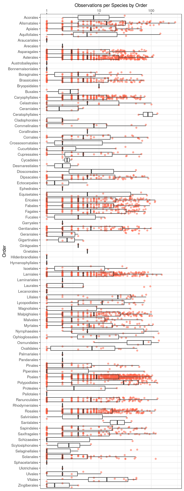
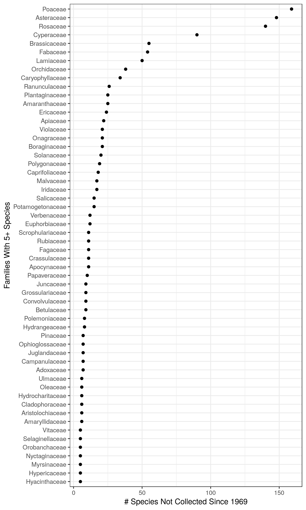
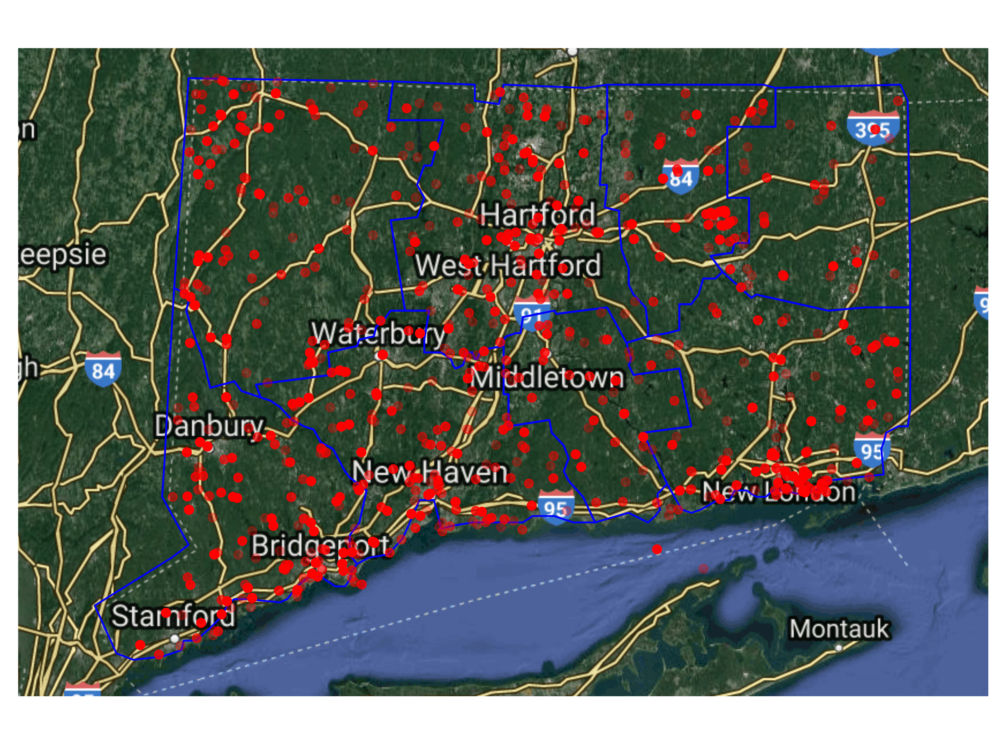

Analysis of CONN Collection
================
James Mickley
January 02, 2019

-   [Overview](#overview)
    -   [Summary of Results](#summary-of-results)
-   [Sampling](#sampling)
    -   [By County](#by-county)
    -   [By Taxonomic Order](#by-taxonomic-order)
-   [Species Not Recently Collected](#species-not-recently-collected)
    -   [For The State](#for-the-state)
    -   [By County](#by-county-1)
-   [Session Information](#session-information)

Overview
--------

What is this analysis about?

**Note:** The locality-based portion of this analysis does not include location-restricted records, so rare species are likely underrepresented

### Summary of Results

-   

Sampling
--------

### By County

| county     |  families|  species|  observations|
|:-----------|---------:|--------:|-------------:|
| Fairfield  |       211|     2545|         10834|
| Hartford   |       171|     2143|         10359|
| Litchfield |       189|     2171|         11750|
| Middlesex  |       156|     1423|          4151|
| New Haven  |       199|     2129|          7792|
| New London |       205|     2348|         11025|
| Tolland    |       241|     2247|         10941|
| Windham    |       144|     1126|          3329|

### By Taxonomic Order

Species Not Recently Collected
------------------------------

### For The State

### By County

Session Information
-------------------

    R version 3.5.1 (2018-07-02)
    Platform: x86_64-pc-linux-gnu (64-bit)
    Running under: Ubuntu 18.04.1 LTS

    Matrix products: default
    BLAS: /usr/lib/x86_64-linux-gnu/blas/libblas.so.3.7.1
    LAPACK: /usr/lib/x86_64-linux-gnu/lapack/liblapack.so.3.7.1

    locale:
     [1] LC_CTYPE=en_US.UTF-8       LC_NUMERIC=C              
     [3] LC_TIME=en_US.UTF-8        LC_COLLATE=en_US.UTF-8    
     [5] LC_MONETARY=en_US.UTF-8    LC_MESSAGES=en_US.UTF-8   
     [7] LC_PAPER=en_US.UTF-8       LC_NAME=C                 
     [9] LC_ADDRESS=C               LC_TELEPHONE=C            
    [11] LC_MEASUREMENT=en_US.UTF-8 LC_IDENTIFICATION=C       

    attached base packages:
    [1] stats     graphics  grDevices utils     datasets  methods   base     

    other attached packages:
     [1] ggmap_2.7.904   maps_3.3.0      bindrcpp_0.2.2  lubridate_1.7.4
     [5] knitr_1.20      cowplot_0.9.3   forcats_0.3.0   stringr_1.3.1  
     [9] dplyr_0.7.8     purrr_0.2.5     readr_1.1.1     tidyr_0.8.1    
    [13] tibble_1.4.2    ggplot2_3.1.0   tidyverse_1.2.1

    loaded via a namespace (and not attached):
     [1] tidyselect_0.2.5  haven_1.1.2       lattice_0.20-35  
     [4] colorspace_1.3-2  htmltools_0.3.6   yaml_2.2.0       
     [7] rlang_0.3.0.1     pillar_1.3.0      glue_1.3.0       
    [10] withr_2.1.2       modelr_0.1.2      readxl_1.1.0     
    [13] jpeg_0.1-8        bindr_0.1.1       plyr_1.8.4       
    [16] munsell_0.5.0     gtable_0.2.0      cellranger_1.1.0 
    [19] rvest_0.3.2       RgoogleMaps_1.4.3 evaluate_0.12    
    [22] labeling_0.3      curl_3.2          highr_0.7        
    [25] broom_0.5.0       Rcpp_1.0.0        scales_1.0.0     
    [28] backports_1.1.2   jsonlite_1.5      rjson_0.2.20     
    [31] png_0.1-7         hms_0.4.2         digest_0.6.18    
    [34] stringi_1.2.4     grid_3.5.1        rprojroot_1.3-2  
    [37] bitops_1.0-6      cli_1.0.1         tools_3.5.1      
    [40] magrittr_1.5      lazyeval_0.2.1    crayon_1.3.4     
    [43] pkgconfig_2.0.2   xml2_1.2.0        assertthat_0.2.0 
    [46] rmarkdown_1.11    httr_1.3.1        rstudioapi_0.8   
    [49] R6_2.3.0          nlme_3.1-137      compiler_3.5.1
